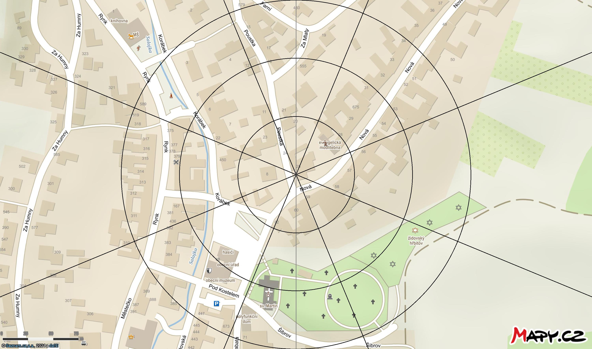

# FengShui PaKua
> A PowerShell script which draws PaKua into any given image.

## How to use it?

1. Download the folder `PaKua to image` or the scripts from this folder to your computer.
2. Run the script `Insert-PaKua.bat`.
3. Enter the source image and the output image.
4. That's it. 

## Sample output

